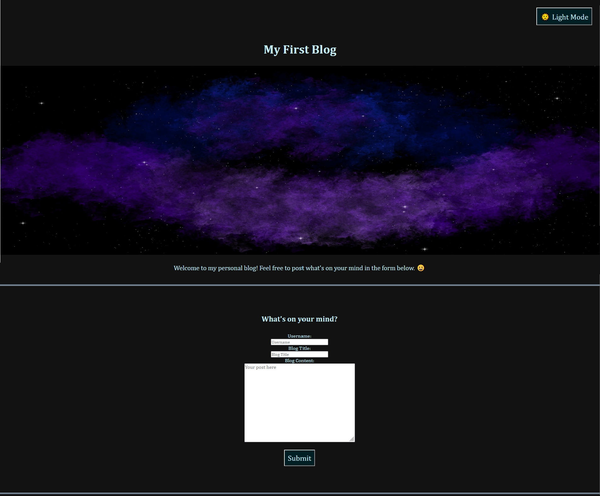
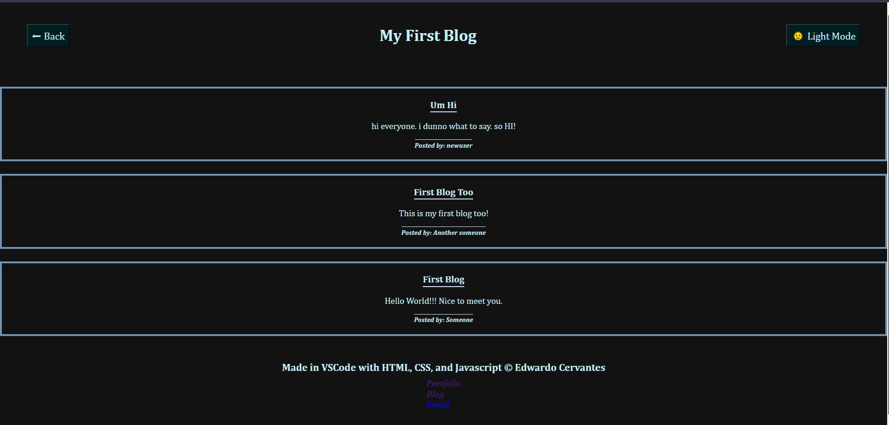

# Personal Blog

## Description

For this project I created a personal blog website. This site takes input in a form and then renders that data on the following page. This was accomplished by creating the needed respective elements in JavaScript, adding the respective data values into their proper fields under the elements, and then appending those elements to the HTML of the page after collecting the data from the form. Another new feature of a site I tried was implementing a "Dark and Light mode" switch to customize the appearance of a page based on a user's preference.

The first thing I did was lay out the HTML of the landing page and creating form elements to take in a user's username, blog post title, and the content of the blog posted. The data was then stored into a JSON array into the user's localStorage using Javascript for it to be called upon in the next page. Once the functions have ran the page automatically loads into the `blog.html` to view the rendered posts.

In the blog posts page the data entered in the landing page is retrieved from the localStorage using `JSON.parse` on localStorage. Then I ran functions to create the respective HTML elements, place the appropriate form value, then append them one by one to the `<article>` element. Lastly, I appended each created `<article>` element to the main content of the page. One thing I wanted to do with this is make sure the most recent post appeared closest to the top of the page. So I researched ways to do this. I stumbled upon `reverse()` which is exactly the simple method needed for this task. Credit to where I found this information can be found below in the "Credits" part of this document.

After setting the webpage's elements and scripts now it was time to place a switch to change both pages' themes. Using what I learned in class and a bit of trial and error I came up with a way to implement the feature using HTML, CSS, and JavaScript. I made a very visible button for easy accessibility as often many pages do have the button well blended within the page. Also, this can allow for the creation of even more color schemes based on more preset themes beyond the dark and light mode features. I plan to experiment with color schemes to see what fits best for webpages and their contents.

All in all, I learned much more about how to traverse the DOM. In addition, this project helped me to continue practicing my HTML, CSS, and JavaScript skills.

[Link to deployed application.](https://excervantes.github.io/personal-blog/)

## Installation

N/A

## Usage

To add a post navigate to the form below the "What's on your mind?" message. There you can enter your username, the blog title, and then the post content for the blog. The page will automatically navigate to the posts displaying all of your past posts starting from the most recently submitted post.

On the posts page you can view each post separated by element boxes with the title, post itself, and the author of the post. If you wanted to add another post simply click the " ⬅ Back " button to get to the landing page to add more posts.

Another note, if you open up the console on the page and look in the localStorage you will see an array of objects containing each of the post(s) displaying the "username", "blog title", and "blog content". 

Lastly, at the top of each page is a button labeled "Light Mode" and "Dark Mode" which will change the appearance of the page and its theme. Give it a try especially if you like dark screens like me.

### Example of Webpage

## Credits

"_How can I reverse an array in JavaScript without using libraries?" - Stack Overflow_. (2012, April 16). Stack Overflow. Retrieved April 20, 2024, from https://stackoverflow.com/questions/10168034/how-can-i-reverse-an-array-in-javascript-without-using-libraries

## License

GNU GENERAL PUBLIC LICENSE
Version 3, 29 June 2007

See LICENSE for more info
